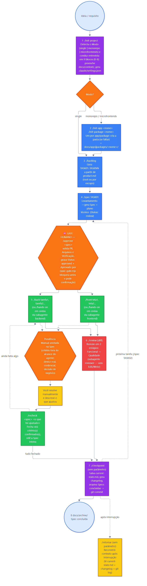

# Scaffold IA — Next.js & NestJS

[](https://www.npmjs.com/package/@robertourias/scaffold-ia)

Harness de contexto persistente para agentes de IA no **Claude Code**. Define
papéis, fluxo spec-driven, padrões de código, guardrails de segurança e
processo de revisão em dois estágios.

---

## O problema que resolve

Agentes de IA não sabem sobre seu projeto: stack, convenções, decisões, regras de negócio. Sem contexto, inventam padrões, repetem perguntas e divergem do planejado.

`docs/` é a memória persistente do **produto** que preenche essa lacuna **sem reensinar tecnologias que o agente já conhece**. `.claude/` é o harness que define **como** os agentes operam sobre esse produto — comandos, subagentes, skills de papel, hooks de verificação e guardrails de permissão.

**Princípio central:** coloque no contexto apenas o que o agente não pode inferir sozinho. Carregue apenas o que é relevante para a tarefa em curso.

---

## Quick Start

### Para um projeto novo

```bash
# 1. Instalar o scaffold (copia .claude/ e docs/ para o diretório atual)
cd seu-projeto
npx @robertourias/scaffold-ia

# 2. Inicializar no Claude Code (o Bloco 6 gera .claude/settings.json)
/init-project sistema de gestão de pedidos para restaurantes
```

Por padrão, `npx @robertourias/scaffold-ia` nunca sobrescreve arquivo
existente (mostra `skip` e segue). `--upgrade`/`-u` atualiza só o harness
(`.claude/` exceto `settings.json`), sobrescrevendo apenas arquivo cujo
conteúdo mudou em relação ao instalado, e em `docs/` só cria o que falta.
`--force`/`-f` sobrescreve tudo, inclusive `docs/`, e pede confirmação se
algum arquivo de `docs/` já tiver sido preenchido com conteúdo diferente do
padrão do scaffold (`--yes`/`-y` confirma sem perguntar, para uso
não-interativo). Alternativa sem npm: `cp -r` dos diretórios `.claude/` e
`docs/` a partir deste repositório clonado.

O comando detecta o **Modo** do projeto (`single`, `monorepo` ou `microfrontends`) e conduz entrevista em **9 blocos (0–8)** (produto em profundidade, arquitetura, decisões backend, frontend, convenções, **guardrails**, **constituição** e **README do repositório**) e preenche o contexto global em `docs/context/`. Também gera `.claude/settings.json` com os limites de permissão do projeto, e atualiza o `README.md` da raiz para quem chega no projeto pela primeira vez. Em monorepo, crie cada app/package depois com `/init-app <nome>` e `/init-package <nome>`, que geram os docs locais e conduzem o questionário de configuração de cada um.

### Para um projeto existente

```bash
cd seu-projeto
npx @robertourias/scaffold-ia --upgrade
```

`--upgrade` atualiza só o harness (`.claude/agents`, `commands`, `hooks`,
`skills`, `templates`, `workflows`, `.claude/CLAUDE.md`, `.claude/README.md`),
sobrescrevendo apenas o que mudou de conteúdo — `.claude/settings.json` e
`docs/context/` são preservados intactos (em `docs/` só cria o que falta).
Grava a versão instalada em `.claude/.scaffold-version`. Se
`.claude/settings.example.json` mudou entre versões, o comando avisa para
você fazer o merge manual no seu `.claude/settings.json`. Se o projeto ainda
tem estrutura obsoleta (`docs/commands/`, `docs/skills/`, `AGENTS.md`),
remova-a manualmente — não faz parte do template atual. Depois, rode
`/init-project` para preencher o que faltar (guardrails, constituição).

---

## Estrutura

`docs/` é só produto. `.claude/` é o harness inteiro.

```
docs/
├── specs/                  ← Specs ativas (Status: review → approved → done)
│   └── YYYY-MM-DD-*.md
│
├── context/                ← Informações únicas do seu produto (preencha estes!)
│   ├── product.md          ← Usuários, regras de negócio
│   ├── product-backlog.md  ← Tasks (gerado por /backlog)
│   ├── conventions.md      ← Nomenclatura, Git, imports
│   ├── decisions.md        ← Escolhas de frontend e backend
│   ├── ui-guidelines.md    ← Design system, tokens, componentes
│   ├── current-state.md    ← Estado atual (atualizado por /checkpoint)
│   ├── guardrails.md       ← Limites invioláveis + verificação (SEMPRE carregado)
│   ├── constitution.md     ← Princípios arquiteturais CN-XXX (SEMPRE carregado)
│   └── domains/            ← Regras de negócio fragmentadas por domínio
│
├── architecture/            ← Visão arquitetural detalhada
│   ├── overview.md
│   ├── backend.md
│   ├── frontend.md
│   └── infra.md
│
├── features/                ← O que o sistema faz hoje (pós-merge)
├── archive/                  ← Specs concluídas
└── changelog/                ← Histórico por data

.claude/
├── CLAUDE.md                 ← carregado automaticamente em toda sessão
├── README.md                  ← referência completa do harness
├── settings.example.json      ← guardrails de permissão + hooks
├── commands/                   ← slash commands (fonte única)
├── agents/                     ← subagentes por papel (contexto isolado)
├── skills/                     ← skills de papel (.claude/skills/<nome>/SKILL.md)
├── hooks/                       ← verificação automática (Pre/PostToolUse, Stop)
├── workflows/                   ← processos de várias fases (sob demanda)
└── templates/                    ← spec-template.md
```

**Monorepo (apps/packages):** cada `apps/<nome>/` e `packages/<nome>/` pode ter
seu próprio `docs/{context,architecture,specs}` — mesma árvore acima, em
miniatura, só com o que é local àquele app/package. A raiz fica com o que é do
monorepo inteiro: produto, decisões cross-cutting, infra, e o inventário de
projetos em `docs/architecture/overview.md`. Os comandos `/spec`, `/back`,
`/front` e `/review` aceitam `apps/<app>` ou
`packages/<pkg>` como primeiro argumento para operar nesse nível (sem ele, inferem do contexto atual — `.claude/workflows/context-resolution.md`); `/retomar` e `/checkpoint` não recebem parâmetro — ver
[Sintaxe de escopo](.claude/README.md#sintaxe-de-escopo) e a
[convenção de documentação em monorepo](docs/context/conventions.md#documentação-em-monorepo-appspackages).

---

## Guardrails

Scaffold é um **harness**, não só documentação: ele é copiado para dentro de um
projeto real, onde o agente tem permissão de escrita no código de produção. Por
isso a inicialização é obrigada a instalar limites antes de liberar o fluxo.

### O que é instalado

| Camada | Arquivo | O que impede |
| --- | --- | --- |
| Permissões | `.claude/settings.json` (base: `settings.example.json`) | leitura de `.env` e chaves, `git push --force`, `reset --hard`, reset de banco, `publish` |
| Verificação automática | `.claude/hooks/` | encerrar o turno com lint quebrado ou type-check vermelho |
| Ferramentas por papel | `.claude/agents/` | o `reviewer` editar o código que ele mesmo revisa |
| Contrato do projeto | `docs/context/guardrails.md` | comandos de verificação obrigatórios, caminhos protegidos, regras `GR-XXX` invioláveis, gatilhos de escalação |
| Gate de processo | `Status: approved` na Spec + `.claude/hooks/spec-gate.mjs` | implementação antes de aprovação humana — agora mecânico, não só instrução |
| Princípios arquiteturais | `docs/context/constitution.md` | Spec ou diff que viole um `CN-XXX` |

### Verificação automática (hooks)

| Hook | Quando | O que roda |
| --- | --- | --- |
| `spec-gate.mjs` | antes de cada edição | pede confirmação ao aprovar Spec; bloqueia os `Arquivos:` da Spec ativa em review |
| `verify-file.mjs` | a cada arquivo editado | ESLint no arquivo alterado |
| `verify-project.mjs` | fim do turno | type-check, se algum `.ts`/`.tsx` mudou |

Falha resulta em `exit 2` + `stderr`, que o Claude Code devolve ao agente para
correção. Todos **falham em aberto**: projeto sem ESLint/TypeScript/git não é
bloqueado. Desligar com `SCAFFOLD_VERIFY=0`.
Detalhes em [`.claude/hooks/README.md`](.claude/hooks/README.md).

`spec-gate.mjs` é heurístico e tem duas regras. **Regra 1 — autoaprovação:**
qualquer edição feita por ferramenta do Claude que tire uma Spec de `Status:
review` (ou crie uma Spec já fora de `review`) pede confirmação humana no
prompt — é o caminho do `/approve`, e uma tentativa de autoaprovação vira um
prompt que o humano nega. **Regra 2 — implementação antes da aprovação:** com
a Spec ativa (`**Spec ativo:**` de `docs/context/current-state.md`) em
`Status: review`, a edição fica bloqueada nos arquivos declarados no campo
`Arquivos:` de cada tarefa (sem nenhum `Arquivos:` declarado, bloqueia todo
código); `docs/` e `.claude/` nunca são bloqueados por essa regra. `/spec`
mantém o campo `Spec ativo:` atualizado ao gerar a Spec, sem esperar pelo
`/checkpoint`.

`docs/context/guardrails.md` é carregado por **todos** os papéis, em **toda**
tarefa, e **vence** qualquer outra instrução do scaffold em caso de conflito.
`docs/context/constitution.md` carrega junto — guardrails restringe o que é
proibido fazer; constitution restringe como o sistema deve ser construído.
Mantenha os dois curtos.

### Como são gerados

| Situação | Comando | Etapa |
| --- | --- | --- |
| Projeto novo ou existente | `/init-project` | Blocos 6 (Guardrails) e 7 (Constituição) |

O comando **infere do repositório real** (scripts do `package.json`, `.gitignore`,
pastas de migration, constraints do schema) antes de perguntar, e registram
`(não configurado)` em vez de inventar um comando que não roda.

### Limitação honesta

`permissions.deny` reduz acidente — **não é sandbox**. Um comando shell criativo
o suficiente contorna a lista de permissões. Guardrail forte depende de:

1. comandos de verificação que realmente rodam (definem o que é "pronto"),
2. os hooks de `.claude/hooks/`, que rodam fora do controle do agente,
3. o gate humano de Spec.

Sem comando de teste/lint/type-check configurado, os Critérios de Aceite viram
autodeclaração do agente. O `/init-project` avisa explicitamente quando isso acontece.

---

## Fluxo de entrega (Spec-driven)

```
Ideia/requisito
      ↓
[1] /init-project (uma vez no início) — detecta o Modo: single | monorepo | microfrontends
      ↓
      ┌─ single ────────────────────────────────────────────────┐
      │                                                          ↓
      │                                            [2] /backlog (gera TASK01..TASKNN)
      │                                                          ↓ ou pule para [3] se for feature avulsa
      └─ monorepo/microfrontends ─┐                              │
                                   ↓                              │
                     /init-app <nome> · /init-package <nome>      │
                     (uma vez por app/package)                    │
                                   └──────────────────────────────┘
                                                  ↓
[3] /spec TASK01 (gera spec + plano de tarefas técnicas, cria branch spec/<slug> e commita)
      ↓
      ⛔ GATE: /approve <spec> — valida e grava Status: approved + Aprovado por + commit (mecânico: .claude/hooks/spec-gate.mjs)
      ↓
[4] /back tarefa1, tarefa2, tarefa3   ou   /hands-on docs/specs/....md (ondas paralelas, review + commit por onda)
      ↓
[5] /front tela1, tela2
      ↓
[6] /review [diff] — review final (no /hands-on) + PR
      ↓
[7] /checkpoint (sem parâmetro — grava resumo da sessão, arquiva Specs done, commita)
      ↓
[8] Specs concluídas migram para docs/archive/ (feito por /checkpoint)
```

**Diagrama do fluxo** (sequência de comandos, branch `spec/<slug>`, ramo single/monorepo, gate `/approve`, paralelismo backend/frontend, review por onda + review final, PR e o ramo de Pendência Manual → `/recheck`):



**Single vs. monorepo/microfrontends:** em `single`, `/init-project` já cobre a stack inteira e o próximo passo é direto `/backlog`. Em `monorepo`/`microfrontends`, `/init-project` cobre só o que é compartilhado (CI/CD, hospedagem, banco); cada app/package precisa passar por `/init-app <nome>` ou `/init-package <nome>` (que criam a pasta, se ainda não existir, e os docs locais em `docs/apps|packages/<nome>/`) antes de gerar o backlog. Os dois caminhos convergem no mesmo `/spec` em diante — `/back`, `/front`, `/review`, `/checkpoint` e `/retomar` funcionam igual, com o escopo inferido do contexto quando não informado (`.claude/workflows/context-resolution.md`).

**Por que o gate importa:** Sem a aprovação, o agente assume escopo e você descobre tarde. A spec com as tarefas técnicas obriga alinhamento **antes** de escrever código — e agora um hook bloqueia mecanicamente a edição de código enquanto a Spec ativa não estiver aprovada. A aprovação em si é feita pelo `/approve` (só o humano invoca — o modelo não dispara sozinho); qualquer tentativa de aprovar a Spec por uma ferramenta de edição pede confirmação humana no prompt.

### Git, review e CI

Cada Spec vive no branch `spec/<slug>`, do `/spec` ao PR. Cada onda do
`/hands-on` faz stage explícito (nunca `git add -A`) e um commit próprio,
precedido pela review da onda (subagente `reviewer`, até 3 rodadas de
correção); ao fechar a Spec roda uma review final sobre o diff do branch
inteiro (1 rodada). Sem achados 🔴 e sem Pendência Manual, o `/hands-on`
oferece abrir o PR `spec/<slug>` → branch padrão (`gh pr create`, sempre com
confirmação humana). Mudança normativa numa Spec já `approved` entra em
`## Emendas` — o `spec-gate.mjs` pede confirmação. O CI
(`.github/workflows/verify.yml`) é instalado pelo `/init-project`. Regras
completas: [`.claude/workflows/git-flow.md`](.claude/workflows/git-flow.md) e
[`docs/specs/README.md`](docs/specs/README.md).

### Playbook (tokens × qualidade)

| Documento | Uso |
| --- | --- |
| [Playbook — modos econômico / rigor / emergência](.claude/workflows/playbook-tokens-qualidade.md) | Decidir **como** trabalhar em cada tarefa (default do dia a dia) |

**Regra prática:** modo econômico no dia a dia; modo rigor (`/spec` com entrevista, `/approve`, `/hands-on --serial`, `/review`) sob demanda — ambiguidade, bug difícil, feature de alto risco. Detalhes no playbook.

---

## Slash Commands

| Comando | Exemplo | O quê |
| --- | --- | --- |
| `/init-project` | `/init-project sistema de pedidos` | Detecta o modo, entrevista, preenche contexto global e guardrails |
| `/init-app` | `/init-app web` | (monorepo) Cria `apps/<nome>`, docs locais e questionário de configuração |
| `/init-package` | `/init-package ui` | (monorepo) Cria `packages/<nome>`, docs locais e questionário de configuração |
| `/backlog` | `/backlog` | Gera TASK01..TASKNN do product.md |
| `/spec` | `/spec TASK01` | Levantamento, gera spec + plano técnico (Status: review), cria branch spec/<slug> |
| `/approve` | `/approve docs/specs/….md` | (só humano) Valida a Spec e aprova: Status review → approved |
| `/groom` | `/groom nova funcionalidade` | Refina uma nova feature isolada adicionando-a ao backlog |
| `/hands-on` | `/hands-on docs/specs/….md` | Executa o plano da Spec em ondas (paralelo), via subagentes, com review por onda, commit e PR |
| `/back` | `/back implementar auth com JWT` | Agente backend, inline |
| `/front` | `/front criar modal de login` | Agente frontend, inline |
| `/review` | `/review [cole diff aqui]` | Revisão 2 estágios: Funcional → Qualidade |
| `/recheck` | `/recheck docs/specs/2026-06-13-onboarding.md testei no dispositivo iOS` | Fecha Pendências Manuais de uma Spec após ajuste feito por você |
| `/checkpoint` | `/checkpoint` | Grava resumo da sessão, gera changelog, arquiva specs concluídas (sem parâmetro) |
| `/retomar` | `/retomar` | Retoma o último histórico salvo após interrupção (sem parâmetro) |

Referência completa: [`.claude/README.md`](.claude/README.md)

Playbook de modos (quando batch vs hands-on): [`.claude/workflows/playbook-tokens-qualidade.md`](.claude/workflows/playbook-tokens-qualidade.md)

---

## Subagentes

Os quatro papéis existem como subagentes em `.claude/agents/`. Cada um roda com
contexto próprio e zerado e devolve só um relatório à thread principal.

| Agente | Ferramentas | Papel |
| --- | --- | --- |
| `backend` | Read, Write, Edit, Grep, Glob, Bash, Skill | implementa tarefas de backend |
| `frontend` | Read, Write, Edit, Grep, Glob, Bash, Skill | implementa tarefas de frontend |
| `reviewer` | Read, Grep, Glob, Bash, Skill | revisa em dois estágios — **sem Edit/Write** |
| `planner` | Read, Write, Edit, Grep, Glob, Bash, Skill | gera Spec + plano em ondas |

Ganhos: contexto isolado (uma onda de 3 tarefas não custa 3× na thread
principal), paralelismo real, e ferramentas como guardrail — o `reviewer` não
consegue editar o código que revisa, não por promessa no prompt, mas porque não
tem a ferramenta.

`/hands-on` despacha `backend` e `frontend` por tarefa. Para tarefa pequena e
avulsa, `/back` e `/front` inline continuam mais baratos. Detalhes em
[`.claude/agents/README.md`](.claude/agents/README.md).

### Skills de papel

Comando inline e subagente do mesmo papel (`/back` e `backend`, por exemplo)
compartilham o conteúdo do papel através de uma skill em
`.claude/skills/<nome>/SKILL.md` — formato padrão do Claude Code. Editar o
papel significa editar a skill uma vez; comando e agente convergem
automaticamente, sem duplicação para ficar dessincronizada.

### Paralelismo seguro

Ondas paralelas escrevem na mesma working tree. Duas tarefas editando o mesmo
arquivo se sobrescrevem **em silêncio**. Por isso:

1. Cada tarefa da Spec declara `Arquivos:` — o que ela cria ou modifica.
2. O `planner` não coloca duas tarefas que disputam um arquivo na mesma onda.
3. O `/hands-on` cruza as listas antes de despachar (Passo 2.5) e serializa se houver colisão.

`--worktree` isola cada tarefa paralela em um git worktree próprio. Raramente
compensa: worktree é checkout novo, sem `node_modules`, e o merge só troca
conflito de arquivo por conflito de git. Use apenas com motivo concreto — a
declaração de arquivos já resolve o problema real.

---

## Economia de Tokens — Controle de Contexto

O design de **carregamento sob demanda** é proposital: cada arquivo existe para ser lido **apenas quando relevante** — nunca em toda sessão.

### Quanto contexto cada papel usa

| Papel | Skill + contexto | Tokens |
| --- | --- | --- |
| Backend | skill `backend` + `conventions.md` + `decisions.md` | ~0.8k |
| Frontend | skill `frontend` + `conventions.md` + `ui-guidelines.md` + `decisions.md` | ~1.1k |
| Planner (Spec + Plan) | skill `planner` + `product.md` + `architecture/overview.md` | ~1.4k |
| Reviewer | skill `quality` + `conventions.md` + `decisions.md` | ~0.8k |

### Estratégias implementadas

**1. Fragmentação por relevância**
- Só carrega o que a tarefa precisa
- Specs vão para `docs/archive/` quando concluídas
- Regras de negócio fragmentadas em `docs/context/domains/` (auth.md, payments.md, etc.)

**2. Delta, não tutorial**
O agente já sabe Next.js, NestJS, TypeScript, Clean Architecture. `docs/` entrega apenas o que é **único do seu produto**:
- Decisões tomadas (Tailwind em vez de styled-components)
- Regras não-óbvias (pedidos acima de R$ 500 precisam aprovação)
- Contexto de domínio (seu modelo de negócio)

**3. Batching**
Agrupe tarefas pequenas em uma chamada:
```
/back implementar use cases: autenticação, criação de pedido, listagem
/front criar páginas: login, home, checkout
```
Reduz overhead de sessões múltiplas.

**4. Compressão ativa**
Antes de fechar, `/checkpoint` gera `current-state.md` comprimido — apenas status alto nível, tarefa ativa e próximos passos. Remove histórico granular.

### Crescimento controlado

O contexto cresce apenas quando:
- Você adiciona nova regra de negócio → `docs/context/product.md` ou `docs/context/domains/*.md`
- Você toma decisão arquitetural → `docs/architecture/*.md` ou `docs/context/decisions.md`
- Você aprova nova feature → novo spec em `docs/specs/`

Tudo mais é descartado ao final de cada feature (specs vão para `docs/archive/`).

### Quando escalar o processo (e quando não)

Para não gastar tokens com processo pesado em tarefa simples — nem subinvestir em feature crítica — use o playbook:
- **[Playbook tokens × qualidade](.claude/workflows/playbook-tokens-qualidade.md)** — modos Econômico (default), Rigor e Emergência

---

## Retomando após interrupção

Quando você volta após horas ou dias, use o par `/checkpoint` + `/retomar`.

**Antes de fechar:**
```
/checkpoint
  → agente lê git log + contexto da sessão
  → escreve current-state.md resumido (pronto, em progresso, próximos passos)
  → arquiva specs concluídas em docs/archive/
```

**Ao voltar:**
```
/retomar
  → agente lê current-state.md + git log + specs ativos
  → apresenta: o quê está pronto, onde parou, próxima ação
```

O `/retomar` funciona mesmo sem checkpoint anterior — ele infere estado do git log. Mas com checkpoint recupera também decisões verbais.

---

## Fluxo completo (exemplo)

```
# Iniciar uma vez
/init-project plataforma de gestão de despesas

# Gerar backlog
/backlog
  → você aprova lista de tarefas

# Especificar e planejar uma tarefa (juntos!)
/spec TASK01

/approve docs/specs/YYYY-MM-DD-task01.md
  → (só humano) valida spec + plano técnico e grava Status: review → approved

# Implementar (batching)
/back implementar use case 1, 2 e 3
/front criar telas X, Y, Z

# Revisar
/review [diff do backend]
/review [diff do frontend]

# Encerrar
/checkpoint
git commit -m "feat: descrição"

# Próxima tarefa
/spec TASK02
```

---

## Migração — Otimizar projeto existente

Se você já tem um projeto rodando com uma versão antiga do scaffold e quer
atualizar para a estrutura atual (harness consolidado em `.claude/`, `docs/`
só produto):

```bash
cd seu-projeto
npx @robertourias/scaffold-ia --upgrade
```

`--upgrade` preserva `docs/context/` e `.claude/settings.json` — atualiza só o
harness (e sinaliza mudanças em `settings.example.json` para merge manual, em
vez de sobrescrever seu `settings.json`). Se seu projeto ainda tem
`docs/commands/`, `docs/skills/`, `docs/workflows/` ou a antiga pasta de
prompts em `docs/` de uma versão anterior, remova-os — o conteúdo equivalente
já veio com o `.claude/` atualizado acima.

Se a documentação de produto (`docs/context/`) estiver desatualizada ou
verbosa demais, rode este prompt no Claude Code:

```
Você é o PLANNER. Atualize a arquitetura de contexto para economizar tokens:

1. Analise docs/context/product.md. Se extenso, fragmente regras em
   docs/context/domains/ (ex: auth.md, payments.md, reports.md),
   deixando product.md apenas com visão geral + links.

2. Mova specs finalizadas de docs/specs/ para docs/archive/.

3. Reescreva docs/context/current-state.md extremamente resumido:
   - Status geral (1 frase)
   - Tarefa em progresso (1 linha)
   - Próximos passos (2-3 linhas)
   - Remove histórico e listas antigas
```

---

## O que cada diretório faz

### `docs/` — produto

| Diretório | Responsabilidade |
| --- | --- |
| `specs/` | Specs ativas (Status: review → approved → done) |
| `context/` | Informações únicas do seu produto — **você preenche** (ou o `/init-project` preenche por você) |
| `architecture/` | Visão técnica: backend, frontend, infra |
| `features/` | Comportamento atual de cada feature entregue |
| `archive/` | Specs concluídas |
| `changelog/` | Histórico por data |

### `.claude/` — harness

| Diretório | Responsabilidade |
| --- | --- |
| `commands/` | Slash commands — fonte única, sem indireção |
| `agents/` | Subagentes por papel, contexto isolado |
| `skills/` | Skills de papel (formato padrão `<nome>/SKILL.md`), compartilhadas entre comando e agente |
| `hooks/` | Verificação automática (gate de Spec, lint, type-check) |
| `workflows/` | Processos de várias fases (feature-delivery, release, playbook tokens×qualidade) |
| `templates/` | `spec-template.md` |

---

## Manutenção

`docs/` e `.claude/` são documentos vivos. Trate como código de produção: versionado, revisado em PR.

Antes de publicar, rode `npm run check`. Para diagnosticar um projeto que já
recebeu o scaffold, use `npx @robertourias/scaffold-ia --check`; o comando é
somente leitura e informa versão instalada e drift local.

### Atualizar um projeto existente

Para atualizar os arquivos do harness sem perder a documentação já preenchida
em `docs/`, use:

```bash
npx --yes @robertourias/scaffold-ia@latest --upgrade
```

`--upgrade` atualiza `.claude/`, cria arquivos novos, preserva `docs/` e
`.claude/settings.json`, e atualiza `.claude/.scaffold-version`. Antes de
atualizar, é possível diagnosticar a instalação:

```bash
npx --yes @robertourias/scaffold-ia@latest --check
git diff -- .claude
```

Não use `--force` para atualizações normais: ele pode sobrescrever documentos
preenchidos em `docs/`. Customizações locais dentro de `.claude/` também podem
ser sobrescritas por `--upgrade`; revise o diff antes de continuar.

Atualize `docs/` quando:
- Decisão arquitetural → `architecture/`
- Regra de negócio → `context/product.md` ou `context/domains/`
- Nova tech/lib → `context/decisions.md`
- Feature aprovada → novo spec em `specs/`

Atualize `.claude/` quando:
- Mudar como um papel deve operar → a skill correspondente em `skills/`
- Adicionar/mudar um slash command → `commands/`
- Adicionar/mudar verificação automática → `hooks/`

Se a **documentação de produto** de um projeto existente ficou pra trás em
relação ao código (status desatualizado, decisões implementadas mas nunca
registradas), atualize `docs/context/` e `docs/architecture/` manualmente (ou
rode `/init-project` para reconciliar) antes de continuar usando o fluxo
normal de specs.

---

## Stack

O núcleo do harness é agnóstico de framework. Durante `/init-project`, escolha
os packs compatíveis em `.claude/packs/`; a seleção fica registrada em
`docs/architecture/overview.md` e pode ser complementada por app/package.

Packs distribuídos atualmente:

| ID | Escopo |
| --- | --- |
| `typescript` | TypeScript estrito e práticas de base |
| `nextjs` | Next.js App Router e React |
| `nestjs` | NestJS para APIs e serviços |
| `turborepo` | Monorepo e tarefas incrementais |

Não há stack padrão implícita: se nenhum pack for escolhido, o scaffold segue
as decisões documentadas pelo projeto sem inventar framework.

---

## Licença

MIT
